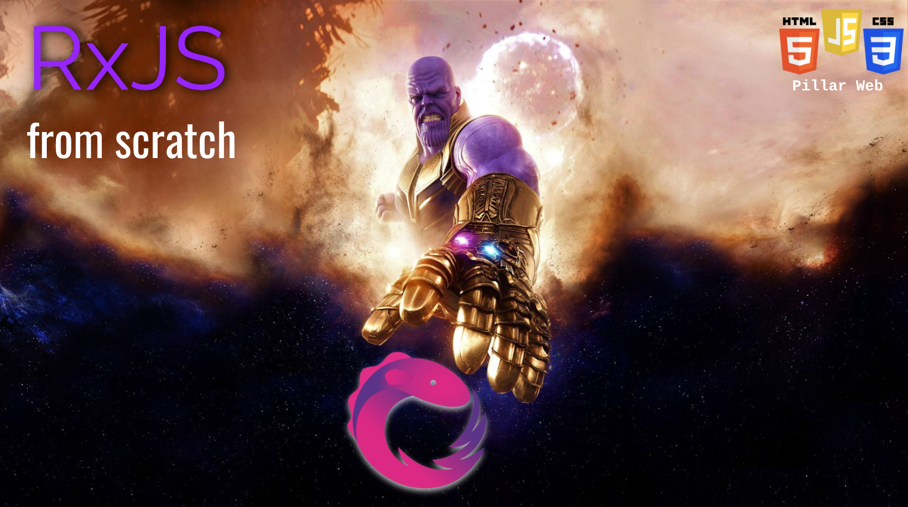

# RxJS from scratch

**Observable** : stream, observer, subscribe, events, hot vs cold

**Operators** : map, tap/do, filter, first/last, debounce/throttle, scan, 
switchMap, zip/forkJoin/merge, catch/retry

**Subjects** : next, multicast, behaviourSubjects

## Presentation
https://docs.google.com/presentation/d/1C8N7bAOoqylVPr4R3t-dvlYc5vpaNXZ9IbvG0_A2-JM/edit?usp=sharing

## Run projet
1. Install dependecies using `npm i`
2. Start webpack in watch mode `npm run build`
3. Insert code in `./main.js` or uncomment lines in `./index.js`